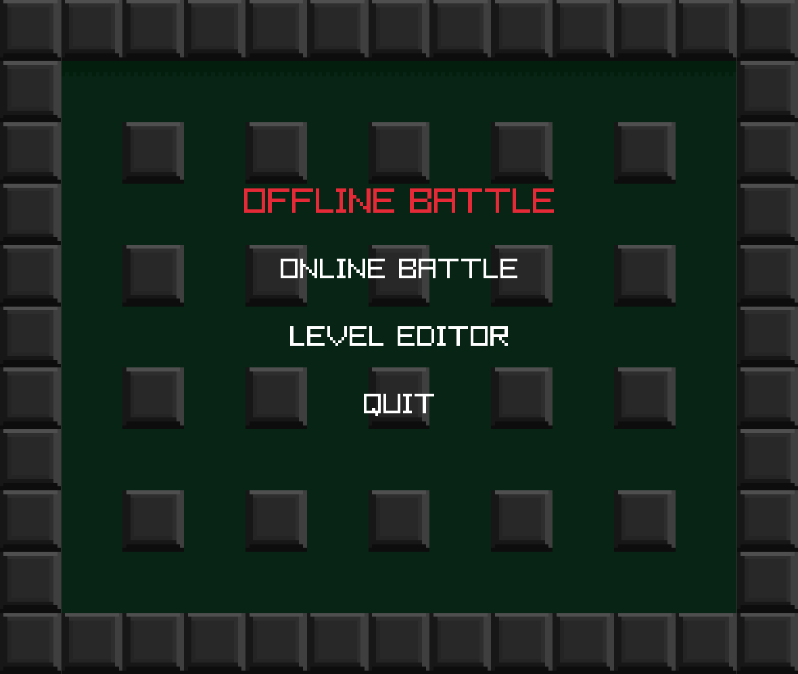
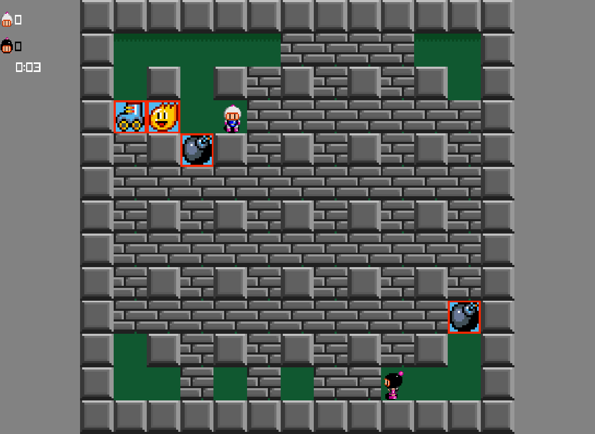
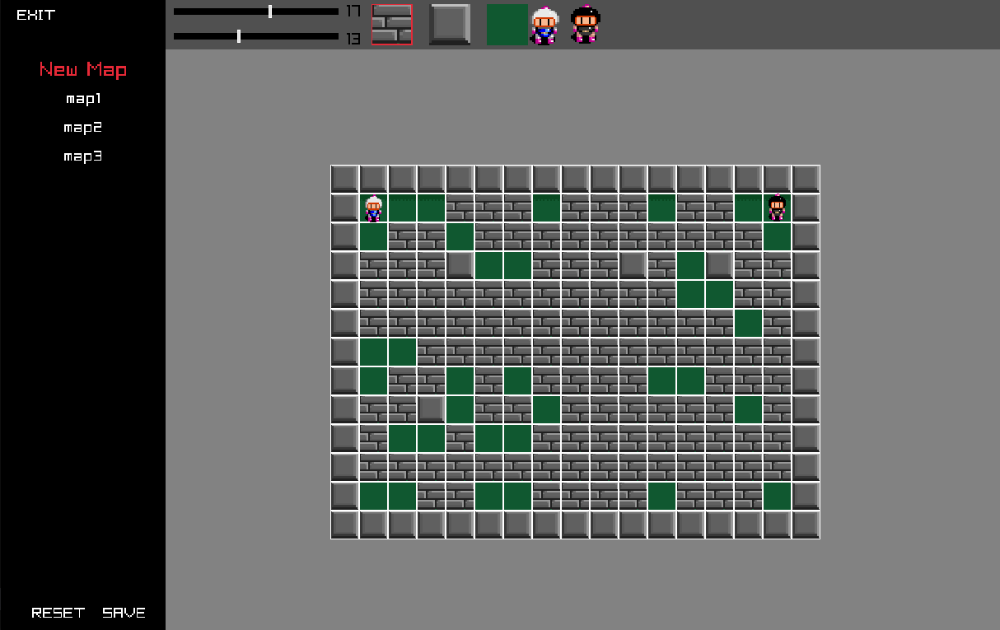

# bomberman-clone
Super bomberman 2 (SNES) clone in Go using <a href="https://github.com/gen2brain/raylib-go">raylib-go</a> .

## features
* Upgrades (speed up, wall pass, extra bomb, wall pass, ...)
* Local multiplayer
* Online multiplayer (grpc)
* Level editor

## TODO
* Single player with AI
* Option menu (for changing sound volume and key maps)
* Pushing bomb upgrade
* Extra health upgrade
* Bug fix